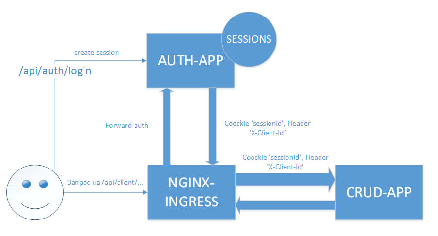

#OTUS-ARCH

Выше приведена схема аутентификации с использованием forward-auth на Ingress-NGINX

Шаги по тестированию:

<ul>
  <li>Устанавливаем приложения в неймспейс crud-app с помощью HELM 
         Сначала ставим crud-app и auth-app набором команд:
         
         cd crud-app/crud-appl-chart
         helm dependency update
         cd ..
         helm install crud-app ./crud-appl-chart/ --values crud-appl-chart/values.yaml -n crud-app
         cd ..        
         cd auth-app
         helm install auth-app ./auth-appl-chart/ --values auth-appl-chart/values.yaml -n crud-app
         cd ..
         
  </li>
  <li>Запускаем тесты Postman командой
        
        newman run auth_postman_collection.json
  </li>
</ul>
