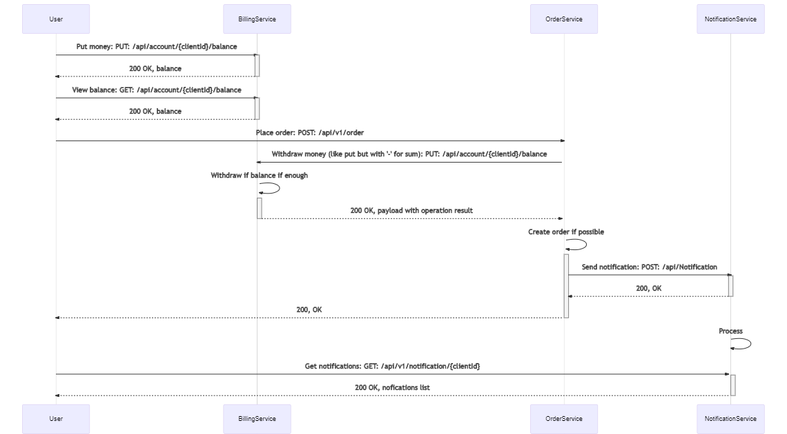
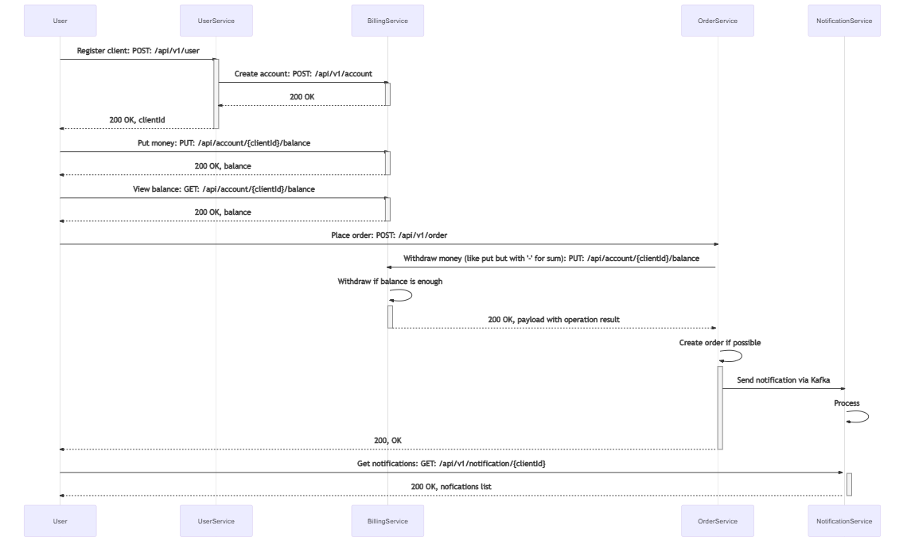
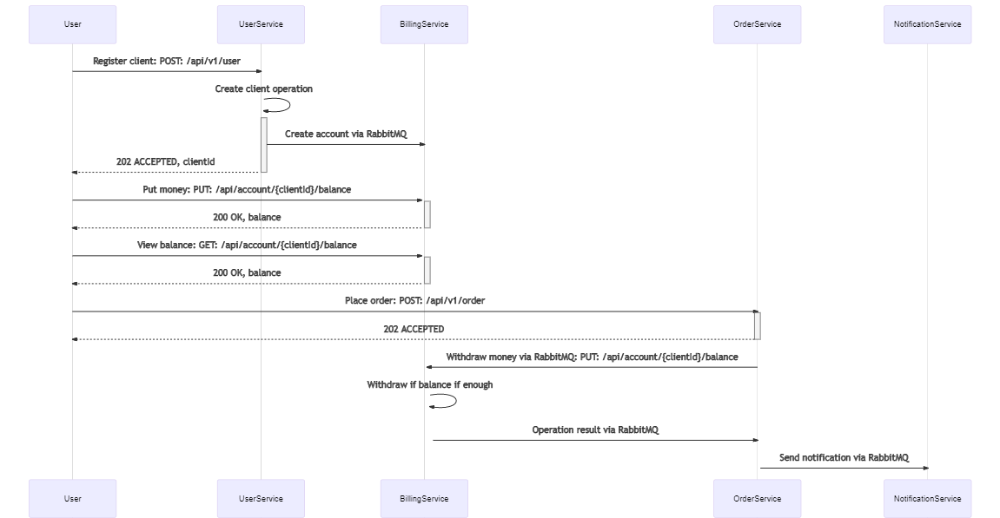
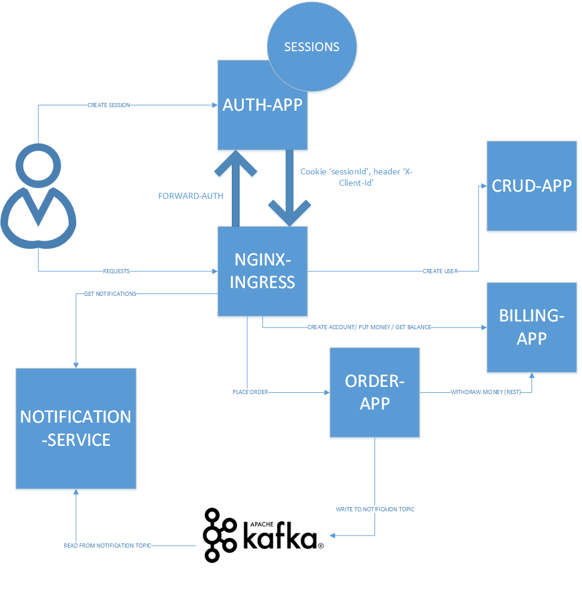

#OTUS-ARCH

#Теоретическая часть. Варианты взаимодействий:
1. Только HTTP взаимодействие
 
2. Событийное взаимодействие с использование брокера сообщений для нотификаций (уведомлений)
 
3. Event Collaboration 
 

Вариант, который мне кажется наиболее адекватным для решения данной задачи:  
№2. Событийное взаимодействие с использование брокера сообщений для нотификаций (уведомлений)

#Практическая часть:

Реализована идемпотентность создания заказа на основе проверки версии. Ищест существующие заказы по id клиента и
стоимости и проверяет. Если такой заказ уже есть и версия нового заказа <= версии существующего, то возвращает
пользователю id существующего заказа, а новый не создаёт и деньги не списывает.

Выше приведена схема взаимодействия сервисов магазина.
Аутентификация реализована с использованием forward-auth на Ingress-NGINX.
ПОльзователю предоставляется RESTful API, при этом межсервисное взаимодействие используется комбинированного вида:
ORDER-APP взаимодействует с BILLING-APP по REST, а с NOTIFICATION-APP асинхронно с помощью Kafka.

Шаги по тестированию:

<ul>
  <li>Устанавливаем приложения в неймспейс crud-app с помощью HELM 
         Сначала ставим crud-app и auth-app набором команд:
         
         cd crud-app/crud-appl-chart
         helm dependency update
         cd ..
         helm install crud-app ./crud-appl-chart/ --values crud-appl-chart/values.yaml
         cd ../auth-app
         helm install auth-app ./auth-appl-chart/ --values auth-appl-chart/values.yaml
         cd ..
         
  </li>
  <li>Затем необходимо установить billing-app 
        
         cd billing-app
         helm install billing-app ./billing-appl-chart/ --values billing-appl-chart/values.yaml
         cd ..
  </li>
  <li>Следующим шагом устанавливаем order-app. Также необходимо обновить зависимости, поскольку 
    он потянет за собой Kafka 
          
         cd order-app/order-appl-chart
         helm dependency update
         cd ..
         helm install order-app ./order-appl-chart/ --values order-appl-chart/values.yaml
         cd ..
  </li>
  <li>И, в завершении, требуется установить notification-app 
          
         cd notification-app
         helm install notification-app ./notification-appl-chart/ --values notification-appl-chart/values.yaml
         cd ..
  </li>
  <li>После старта всех сервисов запускаем тесты Postman командой
        
         order-test.postman_collection.json
  </li>
</ul>
